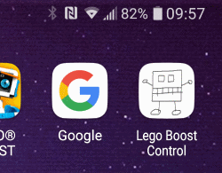

# Lego Boost Browser Application

Control Lego Boost from the browser without any installations.

Deployed to: https://legoboost.azurewebsites.net/

## Features
  * Code control
    * Control Boost with JavaScript code
  * Manual control
    * Control Boost with arrow controls
  * AI control
    * Boost drives automatically and evades obstacles
  * Individual motor control
    * Control each motor individually

### Manual control


<br/>

### Code control


## Progressive Web Application

Application asks permission to add a link to mobile phone's home screen. Application will then open as an application instead of a web site.



## Web Bluetooth API

Application uses [Web Bluetooth API](https://developer.mozilla.org/en-US/docs/Web/API/Web_Bluetooth_API) to communicate with Lego Boost. 

Web Bluetooth API works with __Windows, Mac, Linux__ and __Android__ (6.0->) devices with __Chrome__ and __Opera__ browsers. Unfortunately Apple iOS doesn't support Web Bluetooth. 

[Supported devices](https://github.com/WebBluetoothCG/web-bluetooth/blob/master/implementation-status.md)

### Communication module

Uses [lego-boost-browser](https://github.com/ttu/lego-boost-browser) package for device communication and control.

### Known problems

* Doesn't work with __iOS__ (iPhone and iPad)
  * Apple doesn't support Web Bluetooth API on iOS
* Known bluetooth problems with laptop models:
  * Microsoft Surface Book 2

If connection doesn't work, test connection to Lego Boost with [Google's sample tester](https://googlechrome.github.io/samples/web-bluetooth/read-characteristic-value-changed.html).

## Run locally

```sh
$ npm install
$ npm start
```

## Docker

NOTE: lego-boost-browser package is installed from GitHub. Docker will work after package is released to npm.

## Contributing

Pull requests are welcome. For major changes, please open an issue first to discuss what you would like to change.

## Disclaimer

LEGO and BOOST are Trademarks from The LEGO Company, which do not support this project. 

Project maintainers are not responsible for any damage on your LEGO BOOST devices - use it at your own risk.

## License

Licensed under the [MIT](https://github.com/ttu/lego-boost-app/blob/master/LICENSE) License.